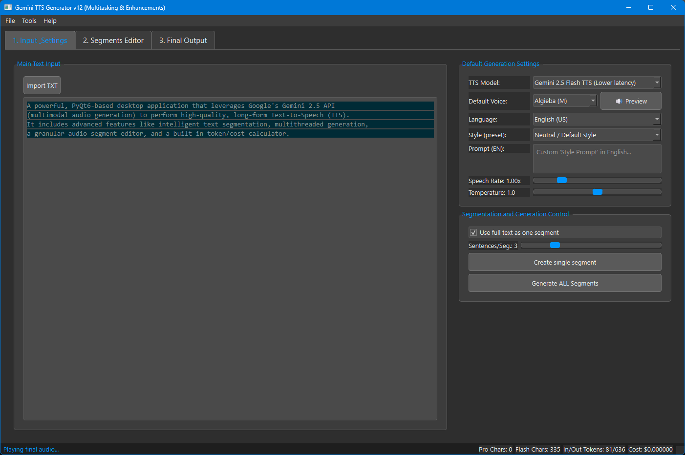
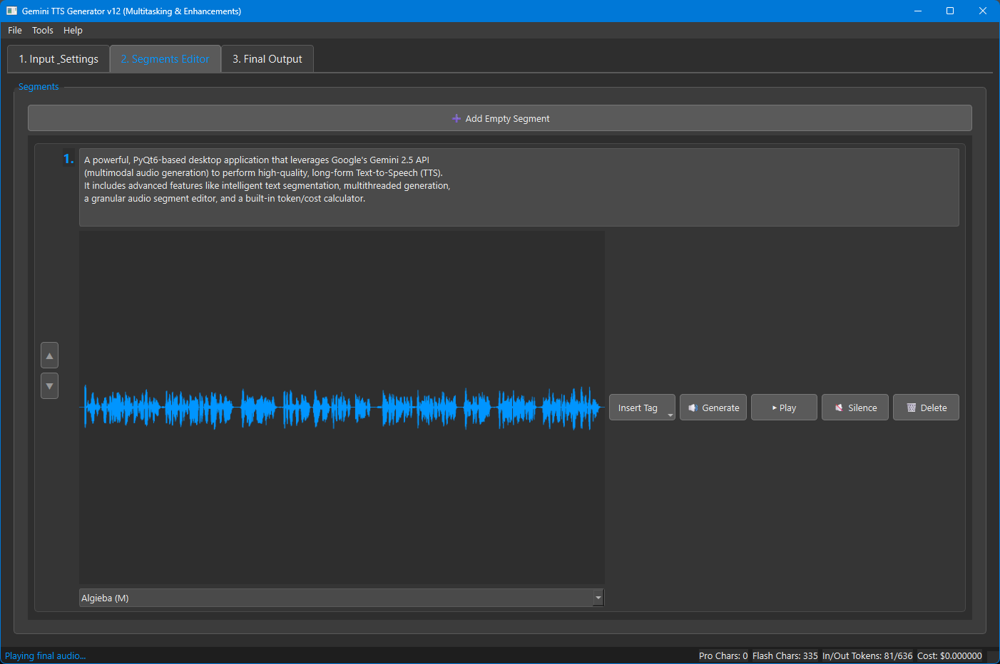
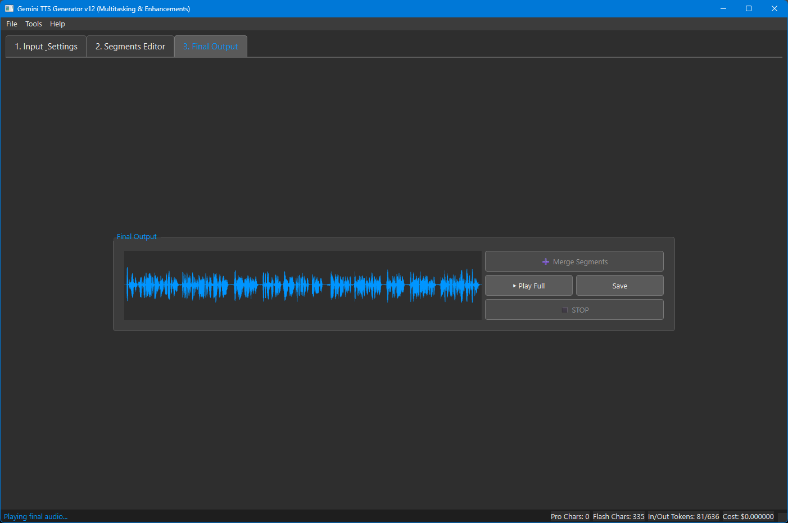

# Gemini TTS Generator

A powerful, PyQt6-based desktop application that leverages Google's Gemini 3.1 API (multimodal audio generation) to perform high-quality, long-form Text-to-Speech (TTS). It includes advanced features like intelligent text segmentation, multithreaded generation, a granular audio segment editor, and a built-in token/cost calculator.



## 🌟 Key Features

- **Google Gemini TTS Integration:** Synthesize highly realistic speech using Google's newest `gemini-2.5-pro` and `gemini-2.5-flash` models.
- **Smart Text Segmentation:** Automatically splits long texts into manageable sentences or chunks using the `stanza` NLP library, ensuring continuous, context-aware audio generation without hitting API limits.
- **Multithreaded Processing:** Generates audio for multiple text segments concurrently in the background without freezing the UI. You can even preview one segment while the next is still downloading!
- **Granular Segment Editor:** 
  - Drag, drop, and reorder segments.
  - Delete, regenerate, or add custom silence gaps to individual audio chunks.
  - Apply custom voice prompts (styles) and change the speaker voice for each segment independently.
- **Visual Waveform Analysis:** Displays audio waveforms for each individual segment and the final merged track using `matplotlib` and `numpy`.
- **Secure API Key Management:** Safely encrypts and stores your Gemini API Key locally using Windows DPAPI, ensuring it is never saved in plain text.
- **Token & Cost Calculator:** Tracks actual input/output token usage from the Gemini API and dynamically calculates your estimated generation cost based on user-defined pricing rates.
- **Project Management:** Save your work as `.json` project files and load them later to resume your editing.
- **Multilingual UI:** Switch the application interface between English, Slovak, and Czech on the fly.




## 🛠️ Prerequisites

- **OS:** Windows 10/11 (Required for the native DPAPI encryption of the API key).
- **Python:** Python 3.9 or higher.
- **API Key:** A valid Google Gemini API key with access to the multimodal audio generation endpoints.

## 📦 Installation

1. **Clone the repository:**
   ```bash
   git clone https://github.com/JohnF51/Gemini-TTS-Generator.git
   cd Gemini-TTS-Generator
   ```

2. **Create a virtual environment & install dependencies (using [uv](https://github.com/astral-sh/uv)):**
   ```bash
   uv venv
   uv pip install -r requirements.txt
   ```
   *(Note: The `stanza` library will download its language models automatically on the first run when splitting text.)*

3. **Activate the environment:**
   ```bash
   # On Windows:
   .venv\Scripts\activate
   ```

## 🚀 Usage

1. **Start the application:**
   ```bash
   python Gemini_TTS.py
   # Or using uv directly without activating:
   # uv run Gemini_TTS.py
   ```

2. **Set your API Key:**
   - Go to `Tools -> Set API Key...` in the top menu bar.
   - Paste your Gemini API key. It will be encrypted and saved locally.

3. **Configure Pricing (Optional):**
   - Go to `Tools -> Pricing...`.
   - Set the current API rates (in USD per 1M tokens/characters) for accurate cost tracking in the status bar.

4. **Generate Audio:**
   - Paste your text into the main input area.
   - Select your preferred model, voice, and language.
   - Click ** Split text into segments**.
   - Click ** Generate ALL Segments** or generate them one by one.
   - Once all segments are generated, click **➕ Merge Segments** to create the final audio file.
   - Save the final output as a `.wav` file.
   


https://github.com/user-attachments/assets/95824816-b98b-4b5b-88ed-411783ec3f86


## 🔐 Security Note

This application uses **Windows DPAPI (Data Protection API)** to encrypt your API key. The encrypted key is stored in `settings.json`. Because DPAPI binds the encryption to your specific Windows user account and machine, the encrypted key cannot be copied to another computer or used by another user.

## 🤝 Contributing

Contributions, issues, and feature requests are welcome! Feel free to check the [issues page](https://github.com/JohnF51/Gemini-TTS-Generator/issues).

## 📝 License

This project is licensed under the MIT License - see the LICENSE file for details.
